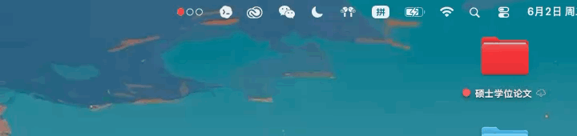
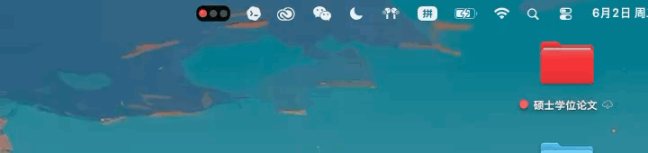

<h1 align="center">Agent Signal Bar 🚦</h1>

<p align="center">
  <a href="README.md">English</a> · <a href="README.zh-CN.md">简体中文</a>
</p>

<p align="center">
  <strong>无需切回终端，也能一眼看出 AI Agent 正在工作、已经完成、遇到阻塞，还是正在等你。</strong>
</p>

<p align="center">
  Codex 自动监控 · Claude Code Hook · 自定义 Agent · 本地优先
</p>

<p align="center">
  <a href="https://github.com/guan-ops/Agent-Signal-Bar/releases/latest"></a>
  <a href="https://github.com/guan-ops/Agent-Signal-Bar/releases/latest"></a>
  <a href="https://github.com/guan-ops/Agent-Signal-Bar/releases/latest"></a>
  <a href="LICENSE"></a>
  <a href="https://agentsignalbar.app"></a>
</p>

<p align="center">
  <a href="https://agentsignalbar.app">
    
  </a>
</p>

<p align="center">
  <a href="https://github.com/guan-ops/Agent-Signal-Bar/releases/latest/download/AgentSignalBar.dmg"><strong>下载最新版 DMG</strong></a>
  · <a href="https://agentsignalbar.app">官网</a>
  · <a href="CHANGELOG.md">更新日志</a>
</p>

Agent Signal Bar 把本地 AI Agent 活动转换成一套简单的红黄绿灯语，显示在 macOS 状态栏和可选的桌面悬浮信号灯中。它能从已知的本地 session 日志自动识别 Codex Desktop、CLI/TUI、VS Code、Xcode 和 IDEA 中的活动；可选 Hook 可补充授权请求和低延迟事件。Claude Code、本地脚本和自定义 Agent 则可以通过本地 Hook、内置 CLI 或 JSON 事件接入。

## 为什么需要 Agent Signal Bar

- **保持工作节奏。** 不用反复打开终端或编辑器，也能知道 Agent 正在思考、执行还是已经完成。
- **及时处理重要状态。** 授权与失败状态拥有更高优先级，不会被普通工作事件盖掉红灯提醒。
- **让状态始终可见。** 可以使用紧凑的状态栏信号灯、可拖动的桌面悬浮灯，也可以同时开启两者。
- **把控制留在本机。** 核心活动监控读取已知的本地日志与状态文件，不要求注册 Agent Signal Bar 账号，也不依赖项目后端。

## 安装

### 系统要求

- macOS 14 Sonoma 或更高版本
- Apple Silicon 或 Intel Mac

### 下载与首次打开

1. 从最新 GitHub Release 下载 [`AgentSignalBar.dmg`](https://github.com/guan-ops/Agent-Signal-Bar/releases/latest/download/AgentSignalBar.dmg)。
2. 打开 DMG，把 `AgentSignalLight.app` 拖入 `Applications`。
3. 从 `Applications` 打开 Agent Signal Bar。

> [!NOTE]
> 当前 GitHub 构建使用 ad-hoc 签名，尚未进行 notarization 公证。如果 Gatekeeper 阻止首次启动，请右键 App 并选择 **打开**，或前往 **系统设置 → 隐私与安全性 → 仍要打开**。

绿色的 **Code → Download ZIP** 按钮下载的是源码，不是 App 安装包。安装后可以通过 **Agent Signal Bar → 检查更新…** 或 **设置 → 关于 → 更新** 使用 Sparkle 更新。

## 实际界面

<table width="100%">
  <tr>
    <td align="center" width="26%"><strong>桌面悬浮灯</strong></td>
    <td align="center" width="37%"><strong>复杂小菜单</strong></td>
    <td align="center" width="37%"><strong>简约小菜单</strong></td>
  </tr>
  <tr>
    <td align="center"><a href="docs/assets/floating-signal-light.png?v=20260908-1"></a></td>
    <td align="center"><a href="docs/assets/menu-bar-panel-detailed-zh-CN.png?v=20260908-1"></a></td>
    <td align="center"><a href="docs/assets/menu-bar-simple-zh-CN.png?v=20260908-1"></a></td>
  </tr>
</table>

以上为 v1.6.0 应用真实界面截图，使用合成演示数据。所有截图统一为深色外观，设置窗口开启 Liquid Glass 并选择「标准」效果。悬浮信号灯可以常驻桌面并跟随状态栏同步变化，支持拖动、自由缩放、尺寸预设、横向或竖向布局，以及紧凑的 session 与用量浮层。

### 运行与用量

<table width="100%">
  <tr>
    <td align="center" width="50%"><strong>运行</strong></td>
    <td align="center" width="50%"><strong>用量</strong></td>
  </tr>
  <tr>
    <td align="center"><a href="docs/assets/settings-activity-zh-CN.png?v=20260908-1"></a></td>
    <td align="center"><a href="docs/assets/settings-usage-zh-CN.png?v=20260908-1"></a></td>
  </tr>
  <tr>
    <td align="center" width="50%"><strong>Codex 账号</strong></td>
    <td align="center" width="50%"><strong>深色 · 标准 Liquid Glass</strong></td>
  </tr>
  <tr>
    <td align="center"><a href="docs/assets/settings-account-zh-CN.png?v=20260908-1"></a></td>
    <td align="center"><a href="docs/assets/settings-glass-zh-CN.png?v=20260908-1"></a></td>
  </tr>
</table>

截图中的账号、活动、额度和 Token 数值均为合成演示数据，演示邮箱为 `demo@agentsignalbar.app`。用量图展开所悬停日期的 GPT-6 Astra 与 gpt-5.6 Token 数量、估算费用和占比，不包含个人账号或凭据数据。Claude 专属截图暂不展示，待真实账号验证完成后补充。

### 选择喜欢的外观

<table width="100%">
  <tr>
    <td align="center" width="50%"><strong>极简圆点</strong></td>
    <td align="center" width="50%"><strong>经典灯牌</strong></td>
  </tr>
  <tr>
    <td align="center"></td>
    <td align="center"></td>
  </tr>
</table>

两种风格都支持横向与竖向布局。你还可以调整闪烁速度、呼吸强度、各状态灯效、颜色主题、Liquid Glass 外观，以及完成或警告提示音——其中包括项目内置的新西兰行人过街声音。

## 主要能力

- **状态栏与桌面信号灯**同步显示红、黄、绿三色动画。
- **重要状态优先的多 session 聚合**，不会让普通工作事件覆盖授权、阻塞、失败和需要检查的状态。
- **无需安装 Hook 的 Codex 监控**，覆盖 Desktop、CLI/TUI、VS Code、Xcode 和 IDEA，并提供 session、额度、Token 和费用视图。
- **多个已保存 Codex 账号**，确保凭据、额度快照与限额重置数据和所选账号对应。
- **详细与原生风格状态栏面板**，显示实时 session、最近活动、暂停、设置和相关 App 快捷入口。
- **本地扩展接口**，包括 Codex Hook、Claude Code Hook、通用 JSON 适配器和 `agent-signal` CLI。
- **适合桌面常驻的自定义选项**，包括两种视觉风格、尺寸预设、自由缩放、声音方案、主题、开机启动和多语言界面。

## 灯语

| Agent 状态 | 默认灯效 | 含义 |
| --- | --- | --- |
| 空闲 `idle` | 绿灯常亮 | 当前无需关注 |
| 思考中 `thinking` | 绿灯快闪 | Agent 正在理解和推理任务 |
| 工作中 `working` | 绿灯慢闪 | 正在编辑、运行工具或测试 |
| 步骤完成 `tool_done` | 绿灯慢闪 | 一个步骤已经结束，工作流可能继续 |
| 已完成 `done` | 绿灯常亮 | 任务完成，稍后回到空闲状态 |
| 需要查看 `attention` / `notification` | 黄灯闪烁 | 有空时检查一下 |
| 等待授权 `permission` / `permission_request` | 红灯闪烁 | 现在需要你的批准 |
| 阻塞或失败 `blocked` / `failure` / `error` | 红灯快速闪烁 | 需要立即处理 |
| 状态不可信 `stale` | 灰黄提示 | 本地状态过期、损坏或不可信 |
| 关闭 `off` / `pause` | 全灭或静止灰色 | 监控已暂停 |

红灯和黄灯状态不会被之后到达的普通工作事件覆盖。完整规则请查看[灯语与聚合优先级](docs/LAMP_LANGUAGE.md)。

## 接入方式

| 来源 | 连接方式 | 当前支持状态 |
| --- | --- | --- |
| Codex Desktop、CLI/TUI、VS Code、Xcode 和 IDEA | 已知的本地 Codex session 日志；可选 Hook | 无 Hook 活动监控已经实际验证；Hook 可补充授权和低延迟事件 |
| Claude Code | Claude Code Hook | 未经过实机测试 |
| 本地脚本与自定义 Agent | 内置 CLI 或通用 JSON 事件 | 通过共享本地状态模型支持 |

可以从 [Codex 接入](docs/CODEX_SETUP.md)、[Claude Code 接入](docs/CLAUDE_CODE_SETUP.md)或[本地脚本接入](docs/LOCAL_SCRIPT_SETUP.md)开始。

## 隐私与联网范围

Agent Signal Bar 是本地优先应用，但不应被理解为完全离线：

- Agent 活动来自已知的本地 Codex 日志，或本地 Hook、CLI 与 JSON 状态。
- 状态快照、Hook 事件、用量扫描缓存和导出的诊断包都留在 Mac 上，除非你主动选择分享。
- 可选的 Codex 账号与额度功能会直接连接 OpenAI，并可使用本地 Codex 凭据或可选的 `chatgpt.com` 浏览器 session 数据。已保存账号凭据和手动输入的 Cookie 使用 macOS Keychain 存储。
- 服务状态与更新检查会分别访问 OpenAI Status 和 GitHub/Sparkle。
- 不要求 Agent Signal Bar 后端账号，也不依赖项目托管的云服务。

## CLI 与自定义 Agent

安装内置 CLI wrapper：

```bash
./script/install_cli.sh
```

写入并查看状态：

```bash
./scripts/agent-signal working --session build-1 --agent script --event BuildStarted
./scripts/agent-signal done --session build-1 --agent script --event BuildFinished
./scripts/agent-signal status --json
```

把任意命令包装成一次 Agent 运行：

```bash
./scripts/agent-signal-run --session nightly-build --agent script -- ./run-build.sh
```

完整事件协议与环境变量见[状态文件 schema](docs/STATE_SCHEMA.md)。

## 从源码构建

需要 macOS 14+、Swift 6 和完整的 Xcode 工具链。

```bash
./script/build_and_run.sh --verify
DEVELOPER_DIR=/Applications/Xcode.app/Contents/Developer swift test
./script/doctor.sh
```

发布打包与 Sparkle feed 细节见 [GitHub 发布管理](docs/GITHUB_RELEASES.md)和[发布检查清单](docs/RELEASE_CHECKLIST.md)。

## 参与贡献

欢迎提交 Issue 和范围清晰的 Pull Request。

1. 如果发现 Bug，或计划修改需要讨论的产品行为，请先创建 [Issue](https://github.com/guan-ops/Agent-Signal-Bar/issues)。
2. 保持改动范围聚焦，并维护本地优先的数据边界。
3. 创建 Pull Request 前，请运行上面的构建验证和 Swift 测试。

产品想法与一般问题可以放到 [GitHub Discussions](https://github.com/guan-ops/Agent-Signal-Bar/discussions)。

## 文档

- [灯语说明](docs/LAMP_LANGUAGE.md) · [状态文件 schema](docs/STATE_SCHEMA.md)
- [Codex 接入](docs/CODEX_SETUP.md) · [Claude Code 接入](docs/CLAUDE_CODE_SETUP.md) · [本地脚本接入](docs/LOCAL_SCRIPT_SETUP.md)
- [更新日志](CHANGELOG.md) · [GitHub 发布管理](docs/GITHUB_RELEASES.md) · [发布检查清单](docs/RELEASE_CHECKLIST.md)

## 致谢与许可证

Agent Signal Bar 由 XiongYang Guan（[guan-ops](https://github.com/guan-ops)）开发。项目内置的新西兰行人过街声音为本项目录制。

Token 用量 JSONL 扫描改编自 Peter Steinberger 创建、使用 MIT License 的 [CodexBar](https://github.com/steipete/CodexBar)。完整作者归属记录在 [NOTICE](NOTICE) 中。

源码基于 [Apache License 2.0](LICENSE) 开源。非代码资产使用 [ASSET_LICENSES.md](ASSET_LICENSES.md) 中的条款，项目名称与品牌资产适用 [TRADEMARKS.md](TRADEMARKS.md)。
